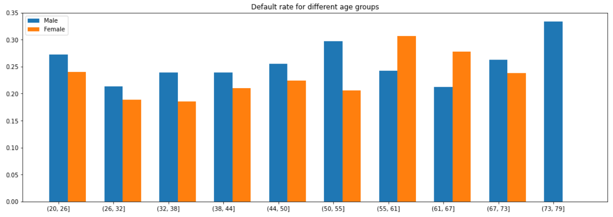
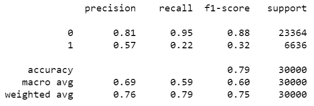
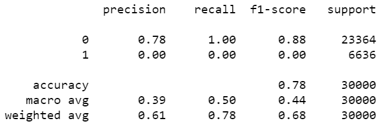

# Progress Report

## Current Progress
### Data understanding

- Understand the meaning of each feature from the data documentation.
- Although there is no missing value in the dataset, we identified some anomalies:
  - EDUCATION has two categories 5 and 6 that are both 'unknown', and an undocumented label 0.
  - MARRIAGE has an undocumented label 0.

### Data preparation and visualization

- Group the 'unknown' and undocumented categories into 'Others'.
- One-hot encode categorical features (Sex, Marriage, Education level).
- Normalize the feature values for logistics regression with min-max scaling.
- Plot histograms and boxplots to find the distribution of feature values.
- Group the samples by their gender and age and find that:
  - People in their 30s and 40s have a lower probability of default;
  - For most age groups, men have a higher probability of default than women.

### Preliminary modeling

- Use 10-fold cross validation to train our model.
- Decision Tree Model: tune hyperparameters from a grid with cross validation.
- Logistic Regression Model: apply L1-regularization.

### Model evaluation

| Decision Tree                                     | Logistic Regression                          |
| ------------------------------------------------- | -------------------------------------------- |
|  |  |

The decision tree model slightly outperforms the logistic regression one.

## Next Step
1. Conduct feature engineering and parameter tuning.
2. Try alternative models:
    - Naïve Bayes Model
    - K-nearest neighbors
    - Ensemble learning methods
    - Neural network
3. Evaluate the result of different models and select the best one.
4. Complete the final report.
